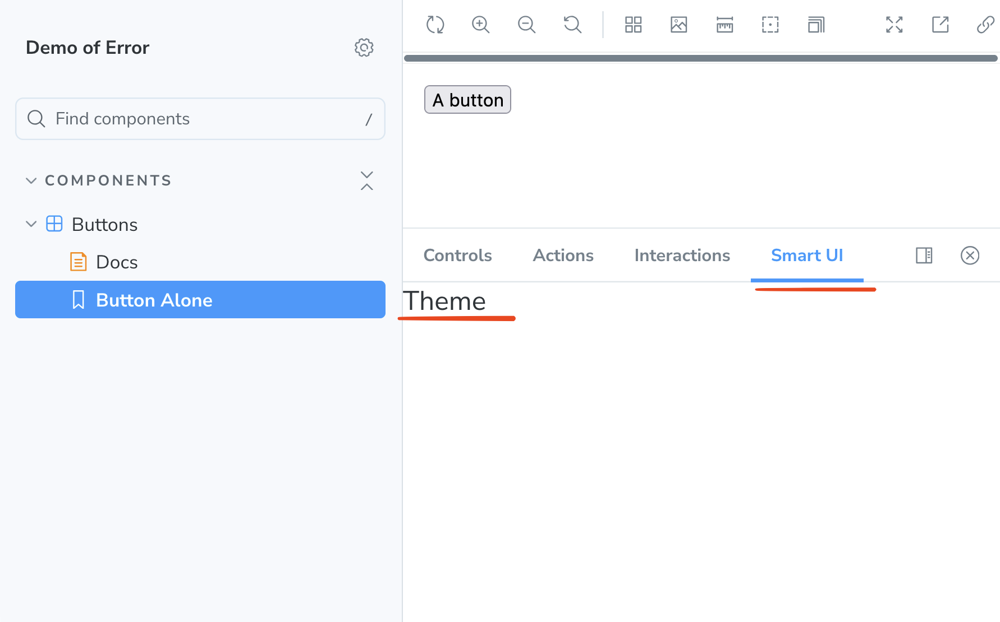

# Error Building Storybook Project

This repository contains a minimum Storybook project to demonstrate this build error, which started occurring after upgrading from Storybook 9 to 10:

```
Failed to load preset: {"type":"presets","name":"/Users/ferdipr/Sources/github/storybook-document-error/addons/smartui/register.js"} on level 1
ReferenceError: document is not defined
  at file://./node_modules/storybook/dist/_browser-chunks/chunk-I74EUU5O.js:4491:12
```

If you want to see the error, switch to the branch `master`. This is a branch using Storybook 9, which works well. It builds well and displays the panel addon:



This project includes the addon in a subdirectory instead of in a separate NPM package `@smartui/storybook`.
